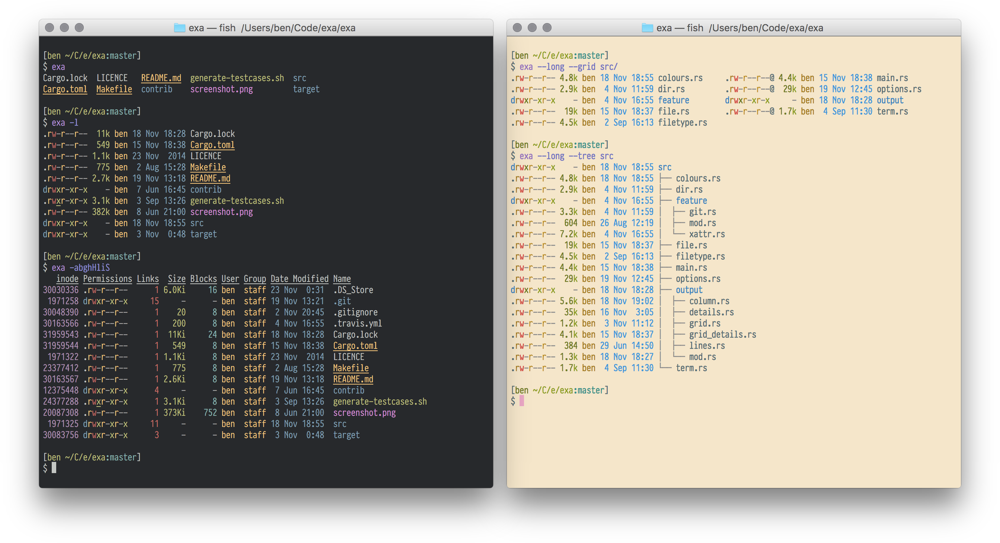

# exa 

[exa](http://bsago.me/exa) is a replacement for `ls` written in Rust.

Works on all recent Rust versions >= 1.4.0.

## Screenshots

## Options

exa’s options are similar, but not exactly the same, as `ls`.

### Display Options

- **-1**, **--oneline**: display one entry per line
- **-G**, **--grid**: display entries in a grid view (default)
- **-l**, **--long**: display extended details and attributes
- **-R**, **--recurse**: recurse into directories
- **-T**, **--tree**: recurse into subdirectories in a tree view
- **-x**, **--across**: sort multi-column view entries across
- **--color**, **--colour**: when to colourise the output

### Filtering Options

- **-a**, **--all**: show dot files
- **-d**, **--list-dirs**: list directories as regular files
- **-L**, **--level=(depth)**: maximum depth of recursion
- **-r**, **--reverse**: reverse sort order
- **-s**, **--sort=(field)**: field to sort by
- **--group-directories-first**: list directories before other files

### Long View Options

These options are available when running with --long (`-l`):

- **-b**, **--binary**: use binary (power of two) file sizes
- **-B**, **--bytes**: list file sizes in bytes, without prefixes
- **-g**, **--group**: show group as well as user
- **-h**, **--header**: show a header row
- **-H**, **--links**: show number of hard links column
- **-i**, **--inode**: show inode number column
- **-m**, **--modified**: display timestamp of most recent modification
- **-S**, **--blocks**: show number of file system blocks
- **-t**, **--time=(field)**: which timestamp to show for a file
- **-u**, **--accessed**: display timestamp of last access for a file
- **-U**, **--created**: display timestamp of creation of a file
- **-@**, **--extended**: display extended attribute keys and sizes
- **--git**: show Git status for a file

Accepted **--color** options are **always**, **automatic**, and **never**.
Valid sort fields are **name**, **size**, **extension**, **modified**, **accessed**, **created**, **inode**, and **none**.
Valid time fields are **modified**, **accessed**, and **created**.

## Installation

exa is written in [Rust](http://www.rust-lang.org).
Once you have it set up, a simple `make install` will compile exa and install it into `/usr/local/bin`.

exa depends on [libgit2](https://github.com/alexcrichton/git2-rs) for certain features.
If you’re unable to compile libgit2, you can opt out of Git support by running `cargo build --release --no-default-features`.

### Cargo Install

If you're using a recent version of Cargo (0.5.0 or higher), you can
use the `cargo install` command:

    cargo install --git https://github.com/ogham/exa

or:

    cargo install --no-default-features --git https://github.com/ogham/exa

Cargo will clone the repository to a temporary directory, build it
there and place the `exa` binary to: `$HOME/.cargo` (and can be
overridden by setting the `--root` option).
